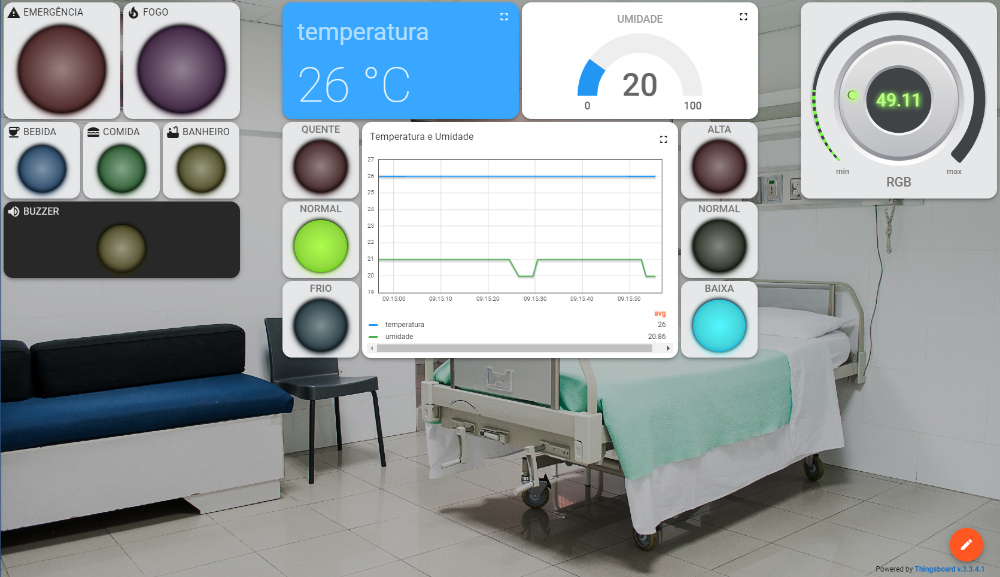

# Trabalho Final - Fundamentos de Sistemas Embarcados

| Matrícula  |        Aluno           |
| ---------- | ---------------------- |
| 19/0107992 | Ana Carolina           |
| 19/0057858 | José Luís              |
| 20/0042416 | Pablo Christiano       |
| 20/0073249 | Pedro Jesus            |

Neste repositório consta o código do [trabalho final](https://gitlab.com/fse_fga/trabalhos-2023_2/trabalho-3-2023-2) que consiste em um sistema para controle de um quarto de hospital inteligente.

Esse projeto se conecta com um servidor Thingsboard utilizando MQTT e envia informações de telemetria, incluindo dados de temperatura em graus Celsius e umidade relativa. Além disso, ele também envia informações de alerta como, incêndio e chamada de enfermeira, incluindo alertas de temperatura alta, temperatura baixa, umidade alta e umidade baixa.

# Hardware

O hardware para esse repositório possui 3 ESPS32, com diferentes entradas e saídas expostas abaixo:

### ESP1

- Sensor de detecção de fogo
- Sensor de led rgb
- led da placa

### ESP 2

- Sensor Infra Vermelho (GPIO 19)
- LED Azul ESP (GPIO 2) - Chamado Bebida
- LED Verde (GPIO 32) - Chamado Comida
- LED Amarelo (GPIO 12) - Chamado Banheiro
- LED Vermelho (GPIO 13) - Chamado Emergência

### ESP 3

- DHT11 (GPIO 04)
- Buzzer (GPIO 15)

# Dependências

[Visual Studio Code](https://code.visualstudio.com/)

[ESP-IDF](https://docs.espressif.com/projects/esp-idf/en/v5.0/esp32/get-started/index.html)

[Thingsboard](https://thingsboard.io/)

# Como rodar

Para rodar o projeto, é necessário executar os seguintes comandos para cada ESP:

1. Atualize as credenciais wifi

2. Compile os códigos-fonte

	`build`

3. Grave o resultado na memória *flash* da ESP32

	`flash`

4. Execute e monitore

	`monitor`

# Dashboard

Abaixo está um imagem do dashboard do Thingsboard com os dados enviados pelo projeto.

# Apresentação

https://github.com/FSE-2023-2/trabalho-final-2023-2-pedro_jose_pablo_ana/assets/69866365/b99c4bf7-d161-42b4-b369-1705e4c755ec

